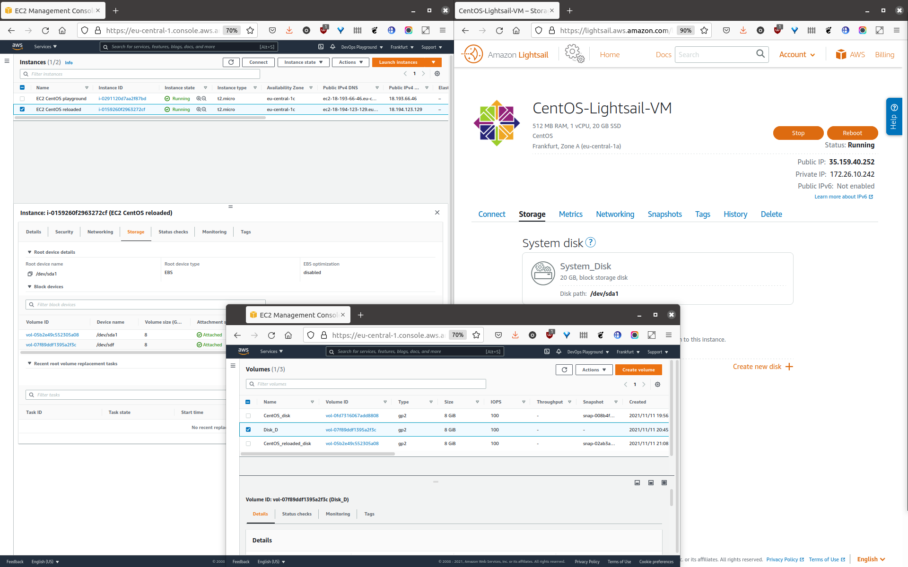

## Task2.2 CLOUD BASICS
### Part 1 - VMs
[7-11]

* registered an AWS account
* created **VM1** (`CentOS-Lightsail-VM`) - Lightsail VM
* created **VM2** (`EC2 CentOS playground`) - EC2 official CentOS instance
* created a **VM2** snapshot
* created **Disk_D** EBS
* attached **Disk_D** to **VM2**
* created empty test.txt in **Disk_D** filesystem
* created **VM3** (`EC2 CentOS reloaded`) - EC2 custom image instance based on a **VM2** snaphot
* attached **Disk_D** to **VM3**

### Part 2 - S3 and Lightsail
[13-15]

* created WordPress instance with Lightsail
* created S3 Bucket (`s3bucket-playground`)
* uploaded and downloaded a file using AWS CLI

### Part 3 - Docker

* created EC2 Amazon Linux instance (`AWS linux docker`)
* created custom docker image (`hello-cloud`) based on `httpd:2.4-alpine`
* uploaded image from `AWS linux docker` to ECS repository
* created ECS cluster
* created task
* started task
* tested apache2 website (`3.69.175.155`)

### Part 4 - Lambda

### Part 5 - Amazon S3 static website

* created a static site on Amazon S3 (http://site.server.cx.ua/)
