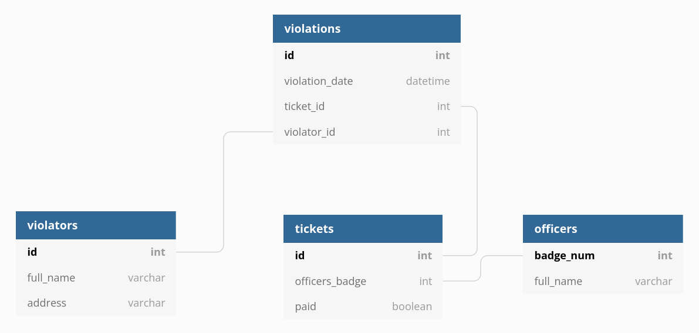
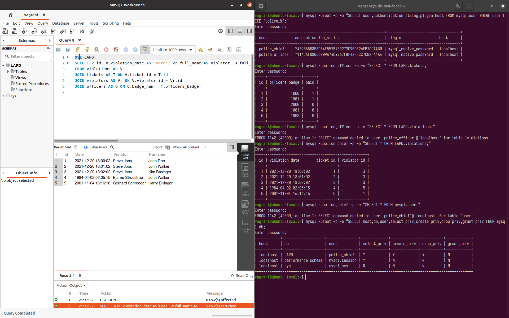
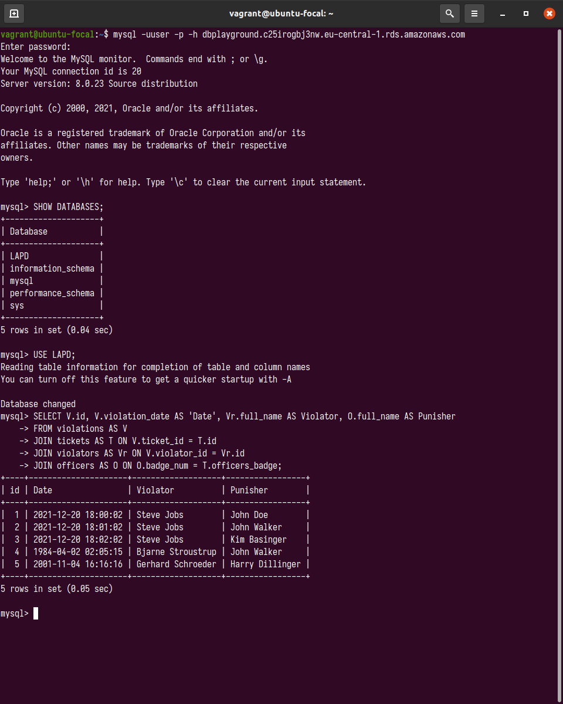

## DATABASE ADMINISTRATION TASK

### PART 1 DATABASE BASICS




#### MySQL installation
Define `MYSQL` virtual machine in [`Vagrantfile`](Vagrantfile)
```ruby
config.vm.define "MYSQL" do |mysql|
    mysql.vm.box = "ubuntu/focal64"
    mysql.vm.provider :virtualbox do |vb|
        vb.name = "db-mysql"
    end
    mysql.vm.hostname = "mysql-vm"

    mysql.vm.network "private_network", ip: "192.168.56.10"
    mysql.vm.network "forwarded_port", guest: 3306, host: 3306
    mysql.vm.provision :shell, path: "bootstrap.sh"
end
```

Provision virtual machine with [`bootstrap.sh`](bootstrap.sh)
```bash
# initialize variables
DBHOST=%
DBNAME=LAPD
DBUSER=user
DBPASSWD=tustan

#  prepare installation
apt-get update

debconf-set-selections <<<"mysql-server mysql-server/root_password password $DBPASSWD"
debconf-set-selections <<<"mysql-server mysql-server/root_password_again password $DBPASSWD"

# install mysql
apt-get -y install mysql-server mysql-client

# create user and grant access
mysql -uroot -p$DBPASSWD -e "CREATE USER '$DBUSER'@'$DBHOST' IDENTIFIED BY '$DBPASSWD';GRANT ALL ON *.* TO '$DBUSER'@'$DBHOST';FLUSH PRIVILEGES;CREATE DATABASE $DBNAME;"

# update mysql conf file to allow remote access to the db
sed -i "s/.*bind-address.*/bind-address = 0.0.0.0/" /etc/mysql/mysql.conf.d/mysqld.cnf

service mysql restart
```


#### Database schema
```SQL
USE LAPD;
CREATE TABLE violators (
    id INT PRIMARY KEY AUTO_INCREMENT,
    full_name VARCHAR(100) NOT NULL,
    address VARCHAR(100) NOT NULL
);

CREATE TABLE officers (
    badge_num INT PRIMARY KEY UNIQUE,
    full_name VARCHAR(100) NOT NULL
);

CREATE TABLE tickets (
    id INT PRIMARY KEY AUTO_INCREMENT,
    officers_badge INT NOT NULL,
    paid BOOLEAN NOT NULL,
    FOREIGN KEY (officers_badge) REFERENCES officers (badge_num)
);

CREATE TABLE violations (
    id INT PRIMARY KEY AUTO_INCREMENT,
    violation_date DATETIME,
    ticket_id INT NOT NULL,
    violator_id INT NOT NULL,
    FOREIGN KEY (ticket_id) REFERENCES tickets (id) ON DELETE CASCADE,
    FOREIGN KEY (violator_id) REFERENCES violators (id)
);

CREATE TABLE vehicles(
    id INT PRIMARY KEY AUTO_INCREMENT,
    plate_number VARCHAR(100) NOT NULL
);
```

Correct schema with some DDL commands:
```SQL
ALTER TABLE violators ADD phone VARCHAR(20) NOT NULL UNIQUE;
DROP TABLE vehicles;
```


#### Tables data
```SQL
INSERT INTO officers (badge_num, full_name) VALUES
('1000', 'John Doe'),
('1001', 'John Walker'),
('1002', 'Margaret Thatcher'),
('2000', 'Kim Basinger'),
('1003', 'Harry Dillinger');

INSERT INTO violators (full_name, address, phone) VALUES
('Gerhard Schroeder', '32004 Germany, Berlin', '32222312'),
('Richard Stallman', '12000 USA, NY', '1024'),
('Steve Jobs', '12010 USA, CA Palo-Alto', '666'),
('Karla Bruni', '4302 Italy, Torino', '0021234568982312'),
('Bjarne Stroustrup', '54023 Denmark, Aarhus', '#0000002b');

INSERT INTO tickets (officers_badge, paid) VALUES
('1000', '1'),
('1001', '1'),
('2000', '0'),
('1001', '0'),
('1003', '0');

INSERT INTO violations (violation_date, ticket_id, violator_id) VALUES
('2021-12-20 18:00:02', '1', '3'),
('2021-12-20 18:01:02', '2', '3'),
('2021-12-20 18:02:02', '3', '3'),
('1984-04-02 02:05:15', '4', '5'),
('2001-11-04 16:16:16', '5', '1');
```

Make corrections:
```SQL
UPDATE tickets SET paid = '0' WHERE id = 4;
```


#### SQL queries
```SQL
USE LAPD;
SELECT V.id, V.violation_date AS 'Date', Vr.full_name AS Violator, O.full_name AS Punisher
FROM violations AS V
JOIN tickets AS T ON V.ticket_id = T.id
JOIN violators AS Vr ON V.violator_id = Vr.id
JOIN officers AS O ON O.badge_num = T.officers_badge;

SELECT * FROM officers WHERE badge_num = 2000;
SELECT * FROM violators ORDER BY phone DESC;
SELECT officers_badge, COUNT(*) AS is_paid FROM tickets WHERE paid = 1 GROUP BY officers_badge;

DELETE FROM tickets WHERE officers_badge = '2000';
```

#### User database
Create users:
```SQL
CREATE USER 'police_officer'@'localhost' IDENTIFIED WITH mysql_native_password BY 'robocop';
CREATE USER 'police_chief'@'localhost' IDENTIFIED WITH mysql_native_password BY 'robochief';
```

Give permissions:
```SQL
GRANT CREATE, DROP, DELETE, INSERT, SELECT, UPDATE on LAPD.tickets TO 'police_officer'@'localhost';
SHOW GRANTS FOR 'police_officer'@'localhost';
GRANT ALL PRIVILEGES on LAPD.* TO 'police_chief'@'localhost';
SHOW GRANTS FOR 'police_chief'@'localhost';
```

Correct the mistake:
```SQL
REVOKE CREATE, DROP, DELETE on LAPD.tickets FROM 'police_officer'@'localhost';
SHOW GRANTS FOR 'police_officer'@'localhost';
FLUSH PRIVILEGES;
```

Test the permissions:
```bash
mysql -uroot -p -e "SELECT user,authentication_string,plugin,host FROM mysql.user WHERE user LIKE 'police_%';"
```
Police officer has the permission to select data from `tickets` table:
```bash
mysql -upolice_officer -p -e "SELECT * FROM LAPD.tickets;"
```
But doesn't have one for any other:
```bash
mysql -upolice_officer -p -e "SELECT * FROM LAPD.violations;"
```
Police department chief does have all the permissions for `LAPD` database:
```bash
mysql -upolice_chief -p -e "SELECT * FROM LAPD.violations;"
```
But can't even select data from other databases:
```bash
mysql -upolice_chief -p -e "SELECT * FROM mysql.user;"

```



#### Main DB tables
```SQL
USE mysql;
SHOW databases;
SHOW tables;
SELECT * FROM db;
```

### PART 2 DATABASE TRANSFER

#### Database backup

```bash
mysqldump -uroot -p LAPD > /vagrant/LAPD_base.sql
```

Corrupt the database:
```bash
mysql -uroot -p -e "DROP table LAPD.violations;"
mysql -uroot -p -e "SHOW TABLES IN LAPD;"
```
Restore the database:
```bash
mysql -uroot -p LAPD < /vagrant/LAPD_base.sql
mysql -uroot -p -e "SHOW TABLES IN LAPD;"
```

Make a check:
```bash
mysql -upolice_chief -p -e "SELECT * FROM LAPD.violations ORDER BY violation_date DESC;"
```


#### AWS RDS
Move local database to a newly created RDS MySQL (`dbplayground`):
```bash
mysql -uuser -p -h dbplayground.c25irogbj3nw.eu-central-1.rds.amazonaws.com LAPD < /vagrant/LAPD_base.sql
```

Connect to `dbplayground`:
```bash
mysql -uuser -p -h dbplayground.c25irogbj3nw.eu-central-1.rds.amazonaws.com
```


Make a dump:
```
mysqldump -uuser -p -h dbplayground.c25irogbj3nw.eu-central-1.rds.amazonaws.com LAPD > /vagrant/dbplayground-LAPD.sql
```

### PART 3 MONGODB

#### MongoDB installation
Define `MONGO` virtual machine in [`Vagrantfile`](Vagrantfile)
```ruby
  config.vm.define "MONGO" do |mongo|
    mongo.vm.box = "ubuntu/focal64"
    mongo.vm.provider :virtualbox do |vb|
      vb.name = "db-mongo"
    end
    mongo.vm.hostname = "mongo-vm"

    mongo.vm.network "private_network", ip: "192.168.56.20"
    mongo.vm.network "forwarded_port", guest: 27017, host: 27017
    mongo.vm.provision :shell, path: "bootstrap.sh"
  end
```

Provision virtual machine with [`bootstrap.sh`](bootstrap.sh)
```bash
# prepare installation
wget -qO - https://www.mongodb.org/static/pgp/server-6.0.asc | sudo apt-key add -
echo "deb [ arch=amd64,arm64 ] https://repo.mongodb.org/apt/ubuntu focal/mongodb-org/6.0 multiverse" | sudo tee /etc/apt/sources.list.d/mongodb-org-6.0.list

apt-get update

# install mongodb
apt-get install -y mongodb-org net-tools

# fix ubuntu 20.04 permissions problem
chown -R mongodb:mongodb /var/lib/mongodb
chown mongodb:mongodb /tmp/mongodb-27017.sock

# start mongod
service mongod restart

sleep 20

# query the database
mongosh < /vagrant/mongo_base.js
```

Prepare a query script [`mongo_base.js`](mongo_base.js)
```js
use world;
db.createCollection("countries");
show databases;
show collections;
db.countries.insertOne({
	name: "Ukraine",
	rating: 85
});
db.countries.insertMany([
	{name: "Belgium", rating: 83},
	{name: "Germany", rating: 46},
	{name: "Canada", rating: 2}
]);
db.countries.find();
```


#### MongoDB query result
```console
$ vagrant up MONGO
<...>
MONGO: test> switched to db world
MONGO: world> { ok: 1 }
MONGO: world> admin   40.00 KiB
MONGO: config  12.00 KiB
MONGO: local   40.00 KiB
MONGO: world    8.00 KiB
MONGO: world> countries
MONGO: world> ... ... ... {
MONGO:   acknowledged: true,
MONGO:   insertedId: ObjectId("635541b7ef74f0200f645808")
MONGO: }
MONGO: world> ... ... ... ... {
MONGO:   acknowledged: true,
MONGO:   insertedIds: {
MONGO:     '0': ObjectId("635541b7ef74f0200f645809"),
MONGO:     '1': ObjectId("635541b7ef74f0200f64580a"),
MONGO:     '2': ObjectId("635541b7ef74f0200f64580b")
MONGO:   }
MONGO: }
MONGO: world> [
MONGO:   {
MONGO:     _id: ObjectId("635541b7ef74f0200f645808"),
MONGO:     name: 'Ukraine',
MONGO:     rating: 85
MONGO:   },
MONGO:   {
MONGO:     _id: ObjectId("635541b7ef74f0200f645809"),
MONGO:     name: 'Belgium',
MONGO:     rating: 83
MONGO:   },
MONGO:   {
MONGO:     _id: ObjectId("635541b7ef74f0200f64580a"),
MONGO:     name: 'Germany',
MONGO:     rating: 46
MONGO:   },
MONGO:   {
MONGO:     _id: ObjectId("635541b7ef74f0200f64580b"),
MONGO:     name: 'Canada',
MONGO:     rating: 2
MONGO:   }
MONGO: ]
```

