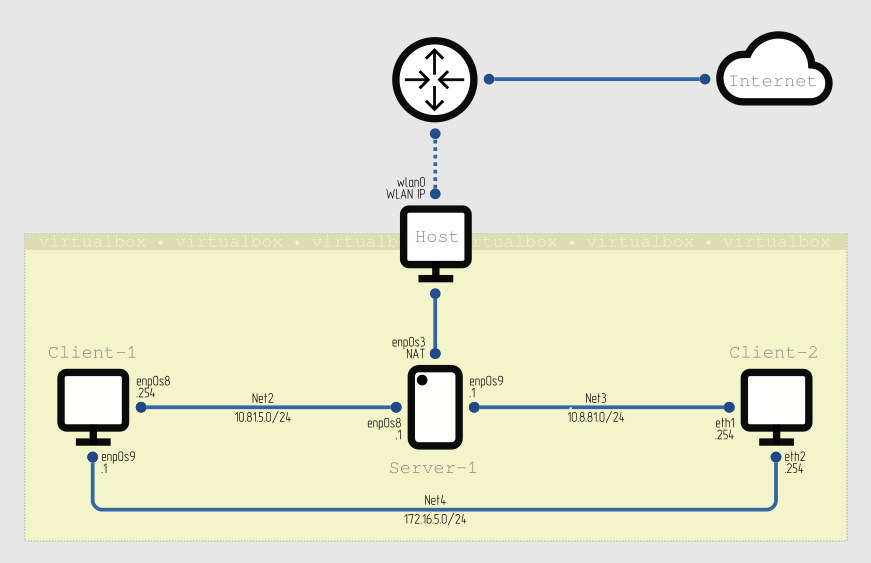

## LINUX NETWORKING TASK



### NETWORK BUILD-UP

1.&nbsp;The lab is built using [`Vagrantfile`](dnsmasq/Vagrantfile). Three virtual machines are provisioned:

| | Server-1 | Client-1 | Client-2 |
| ---: | :---: | :---: | :---: |
| OS | ubuntu/focal64 | ubuntu/focal64 | centos/7 |
| Net2 | enp0s8 (static 10.81.5.1) | enp0s8 (dhcp 10.81.5.254) | -- |
| Net3 | enp0s9 (static 10.8.81.1) | -- | enp0s8 (dhcp 10.8.81.254) |
| Net4 | -- | enp0s9 (static 172.16.5.1) | enp0s9 (static 172.16.5.254) |


### DNSMASQ DHCP + DNSMASQ DNS server

2.&nbsp;**Server-1** is provisioned with [`bootstrap.sh`](dnsmasq/bootstrap.sh) in order to get `dnsmasq` DHCP and DNS server up and running:

```bash
<...>
# install dnsmasq
apt-get update && apt-get install dnsmasq -y
systemctl disable systemd-resolved
systemctl stop systemd-resolved

# configure dnsmasq
cp /vagrant/dhcp-dns.conf /etc/dnsmasq.d/dhcp-dns.conf
cp /vagrant/hosts /etc/hosts

# start dnsmasq
service dnsmasq restart
<...>
```

Server configuration:
```console
vagrant@Server-1:~$ cat /etc/dnsmasq.d/dhcp-dns.conf | grep -Ev '^$|^#'
bogus-priv
no-resolv
server=/localnet/127.0.0.1
server=8.8.8.8
server=8.8.4.4
local=/localnet/
interface=enp0s8
interface=enp0s9
expand-hosts
domain=localnet
dhcp-range=10.81.5.100,10.81.5.200,12h
dhcp-range=10.8.81.100,10.8.81.200,12h
dhcp-host=Client-1
dhcp-host=Client-2
dhcp-leasefile=/var/lib/misc/dnsmasq.leases
dhcp-authoritative
log-dhcp
```
```console
vagrant@Server-1:~$ cat /etc/hosts
127.0.0.1	localhost
10.81.5.1	Server-1
10.8.81.1	Server-1
10.81.5.254	Client-1
10.8.81.254	Client-2
127.0.1.1	ubuntu-focal	ubuntu-focal
```


### CONNECTIVITY CHECKS

3.&nbsp;The result of ping tests could be seen in the next table:
| | Server-1 | Client-1 | Client-2 |
|-|----------|----------|----------|
| Net2 | Client-1 | Server-1 | --- |
| Net3 | Client-2 | --- | Server-1 |
| Net4 | --- | Client-2 | Client-1 |

At this stage **Server-1** doesn't allow traffic forwarding. Every VM is able to ping directly connected machines only.

4.&nbsp;Now add two IP addresses to **Client-1** and configure routing from **Client-2**.

```console
vagrant@Client-1:~$ sudo ip addr add 172.17.15.1/24 dev lo
vagrant@Client-1:~$ sudo ip addr add 172.17.25.1/24 dev lo
vagrant@Client-1:~$ ip addr show lo
1: lo: <LOOPBACK,UP,LOWER_UP> mtu 65536 qdisc noqueue state UNKNOWN group default qlen 1000
    link/loopback 00:00:00:00:00:00 brd 00:00:00:00:00:00
    inet 127.0.0.1/8 scope host lo
       valid_lft forever preferred_lft forever
    inet 172.17.15.1/24 scope global lo
       valid_lft forever preferred_lft forever
    inet 172.17.25.1/24 scope global lo
       valid_lft forever preferred_lft forever
    inet6 ::1/128 scope host 
       valid_lft forever preferred_lft forever
```

```console
[vagrant@Client-2 ~]$ sudo ip route add 172.17.25.0/24 via 172.16.5.1 dev eth2
[vagrant@Client-2 ~]$ sudo ip route add 172.17.15.0/24 via 10.8.81.1 dev eth1
[vagrant@Client-2 ~]$ ip route
default via 10.8.81.1 dev eth1 proto dhcp metric 100 
10.8.81.0/24 dev eth1 proto kernel scope link src 10.8.81.254 metric 100 
172.16.5.0/24 dev eth2 proto kernel scope link src 172.16.5.254 metric 102 
172.17.15.0/24 via 10.8.81.1 dev eth1 
172.17.25.0/24 via 172.16.5.1 dev eth2
```

```console
vagrant@Server-1:~$ sudo sysctl net.ipv4.ip_forward=1
net.ipv4.ip_forward = 1
vagrant@Server-1:~$ sudo ip route add 172.17.15.0/24 via 10.81.5.254 dev enp0s8
```

Now check the routes to **Client-1** `lo`:
```console
[vagrant@Client-2 ~]$ traceroute 172.17.15.1
traceroute to 172.17.15.1 (172.17.15.1), 30 hops max, 60 byte packets
 1  Server-1.localnet (10.8.81.1)  0.310 ms  0.261 ms  0.220 ms
 2  172.17.15.1 (172.17.15.1)  0.805 ms  0.687 ms  0.827 ms
[vagrant@Client-2 ~]$ traceroute 172.17.25.1
traceroute to 172.17.25.1 (172.17.25.1), 30 hops max, 60 byte packets
 1  172.17.25.1 (172.17.25.1)  0.391 ms  0.420 ms  0.279 ms
 ```

5.&nbsp;Remove previous routes to `lo` and add summary route.

```console
[vagrant@Client-2 ~]$ sudo ip route del 172.17.15.0/24 via 10.8.81.1 dev eth1
[vagrant@Client-2 ~]$ sudo ip route del 172.17.25.0/24 via 172.16.5.1 dev eth2
```

```console
vagrant@Server-1:~$ sudo ip route del 172.17.15.0/24 via 10.81.5.254 dev enp0s8
vagrant@Server-1:~$ sudo ip route add 172.17.0.0/19 via 10.81.5.254 dev enp0s8
```

Check the supernet route:
```console
[vagrant@Client-2 ~]$ traceroute 172.17.25.1
traceroute to 172.17.25.1 (172.17.25.1), 30 hops max, 60 byte packets
 1  Server-1.localnet (10.8.81.1)  0.333 ms  0.278 ms  0.257 ms
 2  172.17.25.1 (172.17.25.1)  0.663 ms  0.612 ms  0.563 ms
[vagrant@Client-2 ~]$ traceroute 172.17.15.1
traceroute to 172.17.15.1 (172.17.15.1), 30 hops max, 60 byte packets
 1  Server-1.localnet (10.8.81.1)  0.366 ms  0.308 ms  0.265 ms
 2  172.17.15.1 (172.17.15.1)  0.656 ms  0.633 ms  0.575 ms
```

6.&nbsp;pass

7.&nbsp;Secure **Server-1** firewall.

```console
vagrant@Server-1:~$ sudo iptables -S
-P INPUT ACCEPT
-P FORWARD ACCEPT
-P OUTPUT ACCEPT
-A INPUT -s 10.8.81.254/32 -p tcp -m tcp --dport 22 -j REJECT --reject-with icmp-port-unreachable
-A FORWARD -s 10.8.81.254/32 -d 172.17.25.1/32 -p icmp -j DROP
```

```console
[vagrant@Client-2 ~]$ ping -c 2 172.17.15.1
PING 172.17.15.1 (172.17.15.1) 56(84) bytes of data.
64 bytes from 172.17.15.1: icmp_seq=1 ttl=63 time=0.662 ms
64 bytes from 172.17.15.1: icmp_seq=2 ttl=63 time=0.956 ms

--- 172.17.15.1 ping statistics ---
2 packets transmitted, 2 received, 0% packet loss, time 1001ms
rtt min/avg/max/mdev = 0.662/0.809/0.956/0.147 ms
[vagrant@Client-2 ~]$ ping -c 2 172.17.25.1
PING 172.17.25.1 (172.17.25.1) 56(84) bytes of data.

--- 172.17.25.1 ping statistics ---
2 packets transmitted, 0 received, 100% packet loss, time 1001ms

[vagrant@Client-2 ~]$ ssh Server-1
ssh: connect to host server-1 port 22: Connection refused
```

8.&nbsp;Set up NAT on **Server-1**
```console
vagrant@Server-1:~$ sudo iptables -t nat -A POSTROUTING -o enp0s3 -j MASQUERADE
```