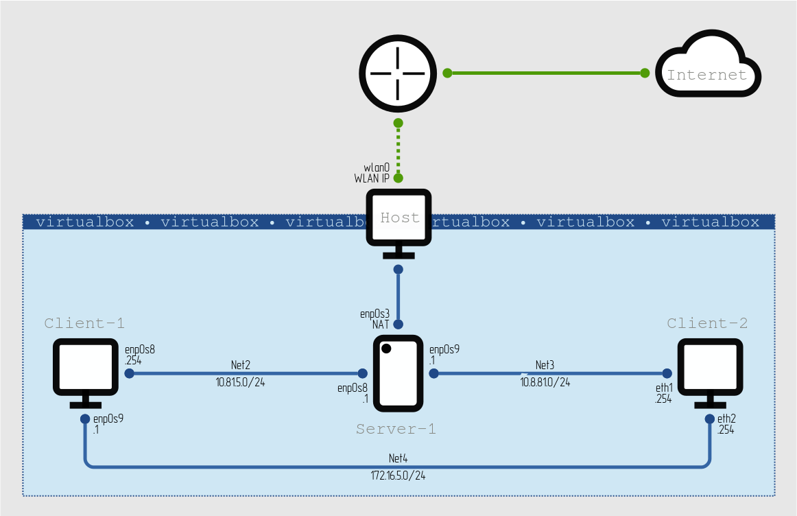

## LINUX NETWORKING TASK



### NETWORK BUILD-UP

The lab is built using [`Vagrantfile`](dnsmasq/Vagrantfile). Three virtual machines are provisioned:

| | OS | Net2 | Net3 | Net4 |
|---|---|---|---|---|
| **Server-1** | ubuntu/focal64 | enp0s8 (static 10.81.5.1) | enp0s9 (static 10.8.81.1) | -- |
| **Client-1** | ubuntu/focal64 | enp0s8 (dhcp 10.81.5.254) | -- | enp0s9 (static 172.16.5.1) |
| **Client-2** | centos/7 | -- | enp0s8 (dhcp 10.8.81.254) | enp0s9 (static 172.16.5.254) |


### DNSMASQ DHCP + DNSMASQ DNS server

**Server-1** is provisioned with [`bootstrap.sh`](dnsmasq/bootstrap.sh) in order to get `dnsmasq` DHCP and DNS server up and running:

```bash
<...>
# install dnsmasq
apt-get update && apt-get install dnsmasq -y
systemctl disable systemd-resolved
systemctl stop systemd-resolved

# configure dnsmasq
cp /vagrant/dhcp-dns.conf /etc/dnsmasq.d/dhcp-dns.conf
cp /vagrant/hosts /etc/hosts

# start dnsmasq
service dnsmasq restart

# enable routing and NAT
sysctl -w net.ipv4.ip_forward=1
iptables -t nat -A POSTROUTING -o enp0s3 -j MASQUERADE
<...>
```

// TODO: Update server configuration

Server configuration:
```console
vagrant@vm1:~$ cat /etc/dnsmasq.d/dhcp-dns.conf | grep -Ev '^$|^#'
bogus-priv
no-resolv
server=/localnet/127.0.0.1
server=8.8.8.8
server=8.8.4.4
local=/localnet/
interface=enp0s8
expand-hosts
domain=localnet
dhcp-range=192.168.12.10,192.168.12.50,12h
dhcp-host=vm2
dhcp-host=vm3
dhcp-option=option:ntp-server,192.168.12.10
dhcp-leasefile=/var/lib/misc/dnsmasq.leases
log-dhcp
```
```console
vagrant@vm1:~$ cat /etc/hosts
127.0.0.1	localhost
192.168.12.10	vm1
192.168.12.20	vm2
192.168.12.30	vm3
```


### SERVER CHECKS

3.&nbsp;Check **VM2** and **VM3** for obtaining network addresses from DHCP server.

```console
$ vagrant ssh -c "ip addr show enp0s8 | grep 'inet '" VM2
    inet 192.168.12.20/24 brd 192.168.12.255 scope global dynamic enp0s8
Connection to 127.0.0.1 closed.

$ vagrant ssh -c "ip addr show enp0s8 | grep 'inet '" VM3
    inet 192.168.12.30/24 brd 192.168.12.255 scope global dynamic enp0s8
Connection to 127.0.0.1 closed.
```

5.&nbsp;Check **VM2** and **VM3** for gaining access to DNS server (naming services).

```console
$ vagrant ssh -c "ping -c 3 vm1" VM2
PING vm1.localnet (192.168.12.10) 56(84) bytes of data.
64 bytes from vm1.localnet (192.168.12.10): icmp_seq=1 ttl=64 time=0.236 ms
64 bytes from vm1.localnet (192.168.12.10): icmp_seq=2 ttl=64 time=1.11 ms
64 bytes from vm1.localnet (192.168.12.10): icmp_seq=3 ttl=64 time=1.22 ms

--- vm1.localnet ping statistics ---
3 packets transmitted, 3 received, 0% packet loss, time 2109ms
rtt min/avg/max/mdev = 0.236/0.852/1.216/0.438 ms
Connection to 127.0.0.1 closed.

$ vagrant ssh -c "resolvectl query epam.com" VM3
epam.com: 3.214.134.159                        -- link: enp0s8

-- Information acquired via protocol DNS in 62.0ms.
-- Data is authenticated: no
Connection to 127.0.0.1 closed.
```

